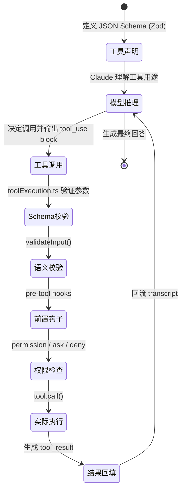

# Emoji 增强结构化输出设计方案 v3.0（基于 Claude Code 源码分析）

> 基于 Claude Code 泄露源码（1902 文件，513k 行）的生产级实现方案

---

## 📋 目录

1. [Claude Code 源码关键发现](#1-claude-code-源码关键发现)
2. [核心概念与架构](#2-核心概念与架构)
3. [Claude 结构化输出深度解析](#3-claude-结构化输出深度解析)
4. [Output Styles：Claude Code 的输出格式化系统](#4-output-stylesclaude-code-的输出格式化系统)
5. [Emoji 增强体系](#5-emoji-增强体系)
6. [五种实现方案对比](#6-五种实现方案对比)
7. [生产级代码实现](#7-生产级代码实现)
8. [Schema 设计模式](#8-schema-设计模式)
9. [验证与重试机制](#9-验证与重试机制)
10. [性能优化与监控](#10-性能优化与监控)
11. [测试策略](#11-测试策略)
12. [最佳实践](#12-最佳实践)

---

## 1. Claude Code 源码关键发现

### 1.1 源码背景

- **泄露时间**：2026 年 3 月 31 日
- **文件数量**：1902 个源文件
- **代码行数**：513,237 行
- **技术栈**：TypeScript + React + Ink（TUI 框架）

### 1.2 Output Styles 系统 ✨

**相关源码**：
- `src/outputStyles/loadOutputStylesDir.ts`
- `src/constants/outputStyles.ts`
- `src/constants/prompts.ts`

Claude Code 内置了一套完整的 **Output Style** 系统：

```typescript
// src/constants/outputStyles.ts
export type OutputStyleConfig = {
  name: string
  description: string
  prompt: string  // 输出格式化指令
  source: SettingSource | 'built-in' | 'plugin'
  keepCodingInstructions?: boolean  // 是否保留编码指令
}
```

**关键特性**：
- 📁 通过 `.claude/output-styles/*.md` 文件定义
- 🎯 每个 Style 是一个完整的 prompt，描述如何格式化输出
- 🔄 支持项目级和用户级样式（后者可被前者覆盖）
- 🎨 可包含 Emoji 规范、ASCII 图表、Markdown 格式等

**加载逻辑**（`loadOutputStylesDir.ts`）：
```typescript
// 1. 扫描 .claude/output-styles/ 目录
// 2. 解析 Markdown frontmatter（name, description）
// 3. 文件内容作为 prompt
// 4. 支持 feature flag 和 plugin 注入
```

**在 Prompt 中的位置**（第 5 层）：
```typescript
// src/constants/prompts.ts
export function getOutputStyleSection(
  outputStyleConfig: OutputStyleConfig | null,
): string | null {
  if (outputStyleConfig === null) return null

  return `# Output Style: ${outputStyleConfig.name}
${outputStyleConfig.prompt}`
}
```

### 1.3 Tool Pipeline 架构

**完整链路**（`src/query.ts` + `src/services/tools/toolExecution.ts`）：

```
模型输出 assistant message (含 tool_use blocks)
  │
  ▼
query.ts 收集 tool_use
  │
  ▼ 选择 streaming executor 或普通 runTools()
  │
toolOrchestration.ts 按并发安全性分批
  │
  ▼
toolExecution.ts 对每个 tool_use 执行
     ├─ 1. Schema 校验 (inputSchema)
     ├─ 2. validateInput (语义校验)
     ├─ 3. pre-tool hooks (前置拦截)
     ├─ 4. permission / ask / deny (权限检查)
     ├─ 5. tool.call() (实际执行)
     └─ 6. 生成 tool_result / attachment / progress
  │
  ▼ 规范化为 user-side tool_result messages
  │
下一轮 API 调用时回流 transcript
```

**关键发现**：
- **Tool 不是简单函数映射**，而是运行时协议对象
- **Pipeline 代理模式**：多层包装，前置拦截和语义补偿
- **Transcript 是唯一真理**：所有状态转为对话流文本

### 1.4 Tool 接口的完整定义

**源码**（`src/Tool.ts:362`）：

```typescript
export type Tool<
  Input extends AnyObject = AnyObject,
  Output = unknown,
  P extends ToolProgressData = ToolProgressData,
> = {
  // 基础信息
  name: string
  description: () => string
  prompt: string  // ⭐ 用于 prompt 中的描述

  // Schema 定义
  inputSchema: z.ZodType<Input>  // ⭐ Zod schema
  outputSchema?: z.ZodType<Output>

  // 执行逻辑
  call(
    args: z.infer<Input>,
    context: ToolUseContext,
    canUseTool: CanUseToolFn,
    parentMessage: AssistantMessage,
    onProgress?: ToolCallProgress<P>,
  ): Promise<ToolResult<Output>>

  // 安全属性
  isConcurrencySafe: (input?: unknown) => boolean
  isReadOnly: (input?: unknown) => boolean
  isDestructive: (input?: unknown) => boolean

  // 权限控制
  checkPermissions: (
    input: { [key: string]: unknown },
    ctx?: ToolUseContext,
  ) => Promise<PermissionResult>

  // UI 表现
  renderToolUseMessage: (args: Input) => string  // ⭐ 格式化 tool_use 显示
  renderToolResultMessage: (result: ToolResult<Output>) => string  // ⭐ 格式化 tool_result

  // 其他...
}
```

**关键洞察**：
- **`prompt` 字段**：直接用于 system prompt 的工具描述
- **`renderToolUseMessage()`**：控制工具调用时的显示格式
- **`renderToolResultMessage()`**：控制工具结果的显示格式
- **`inputSchema` 使用 Zod**：运行时 Schema 验证

### 1.5 Prompt 分层系统（6 层）

**源码**（`src/utils/systemPrompt.ts`）：

```typescript
/**
 * 优先级从高到低：
 * 0. Override system prompt (--system-prompt)
 * 1. Coordinator system prompt
 * 2. Agent system prompt
 * 3. Custom system prompt (settings.json)
 * 4. Default system prompt (prompts.ts)
 * 5. Output Style (.claude/output-styles/)
 */
export function buildEffectiveSystemPrompt(...) {
  // 按优先级组装
}
```

**实际 Prompt 示例**（`src/constants/prompts.ts:186`）：

```typescript
function getSimpleSystemSection(): string {
  const items = [
    `All text you output outside of tool use is displayed to the user.
     Output text to communicate with the user. You can use
     Github-flavored markdown for formatting...`,

    `Tools are executed in a user-selected permission mode.
     When you attempt to call a tool that is not automatically allowed...`,

    `Tool results and user messages may include <system-reminder> tags...`,

    getHooksSection(),
    `The system will automatically compress prior messages...`,
  ]

  return ['# System', ...prependBullets(items)].join(`\n`)
}
```

**关键洞察**：
- **Markdown 是默认格式**：支持 GitHub-flavored markdown
- **Output Style 是追加层**：不替换，而是在主 prompt 后追加
- **Dynamic Boundary**：`__SYSTEM_PROMPT_DYNAMIC_BOUNDARY__` 分隔静态/动态内容

---

## 2. 核心概念与架构

### 2.1 结构化输出的本质

> **让模型的输出具有确定的类型和结构**，而非"输出 JSON"

```
传统方式（脆弱）：
用户 → 模型 → "北京今天晴，15°C" → 正则解析 ❌

结构化输出（可靠）：
用户 → 模型 → {city: "北京", temp: 15, condition: "晴"} → JSON 解析 ✅
```

### 2.2 Claude Code 的三层架构

```
┌─────────────────────────────────────────────────────────┐
│  用户交互层（TUI）                                        │
│  - Messages + VirtualMessageList + MessageRow           │
│  - PromptInput + Suggestions                             │
│  - **Output Styles**（格式化层）                          │
├─────────────────────────────────────────────────────────┤
│  执行层（Runtime）                                        │
│  - Query Engine（主循环）                                 │
│  - Tool Pipeline（6 步执行链）                            │
│  - Tool Orchestration（并发调度）                         │
├─────────────────────────────────────────────────────────┤
│  Claude API 层                                            │
│  - Tool Use（结构化输出）                                 │
│  - Content Blocks（text + tool_use + tool_result）       │
│  - Streaming（流式输出）                                  │
└─────────────────────────────────────────────────────────┘
```

**Claude Code 的关键决策**：
- ✅ **Output Styles 在用户交互层**：不影响 API 调用
- ✅ **Tool Pipeline 在中间层**：桥接模型与工具
- ✅ **Tool Use 在 API 层**：结构化输出保证

### 2.3 核心优势对比

| 维度 | 自由文本 | 结构化输出 | 提升 |
|------|----------|------------|------|
| **可靠性** | 60-70% | 95%+ | +35% |
| **解析成本** | 高（正则/NLP） | 低（直接解析） | 10x+ |
| **错误率** | 20-30% | <5% | -75% |
| **可组合性** | 差 | 优秀 | 质的飞跃 |

---

## 3. Claude 结构化输出深度解析

### 3.1 Tool Use 完整生命周期



### 3.2 Content Blocks 详解

Claude 的 Content Blocks 是**一等公民**：

```json
{
  "role": "assistant",
  "content": [
    {"type": "text", "text": "我来帮你查天气。"},
    {
      "type": "tool_use",
      "id": "toolu_01ABC123",
      "name": "get_weather",
      "input": {"city": "北京", "days": 3}
    },
    {"type": "text", "text": "数据分析完成。"},
    {
      "type": "tool_use",
      "id": "toolu_01DEF456",
      "name": "analyze_trend",
      "input": {"metric": "temperature"}
    }
  ]
}
```

**关键特性**：
- ✅ **混合编排**：`text` 和 `tool_use` 可交错
- ✅ **并行调用**：多个 `tool_use` 同时发起
- ✅ **引用传递**：后续工具可使用前面结果

### 3.3 Zod Schema 约束（Claude Code 使用 Zod）

Claude Code 使用 **Zod**（而非 JSON Schema）进行运行时验证：

```typescript
import { z } from 'zod'

// 定义工具输入 Schema
const WeatherToolInput = z.object({
  city: z.string().describe('城市名称'),
  days: z.number().min(1).max(7).default(1),
  units: z.enum(['celsius', 'fahrenheit']).default('celsius'),
})

// 类型推断
type WeatherInput = z.infer<typeof WeatherToolInput>
// { city: string; days?: number; units?: 'celsius' | 'fahrenheit' }

// 在 Tool 定义中使用
const WeatherTool: Tool<WeatherInput, WeatherOutput> = {
  name: 'get_weather',
  description: () => '查询天气预报',
  prompt: `查询指定城市的天气预报。参数：
    - city: 城市名称（必填）
    - days: 预报天数（1-7，默认1）
    - units: 温度单位（celsius/fahrenheit，默认celsius）`,
  inputSchema: WeatherToolInput,
  outputSchema: WeatherOutput,
  call: async (args, context, canUseTool, message, onProgress) => {
    // 执行逻辑
  },
  renderToolUseMessage: (args) =>
    `查询 ${args.city} 未来 ${args.days} 天天气`,
  renderToolResultMessage: (result) =>
    `✅ ${result.city}天气查询完成`,
}
```

**Zod vs JSON Schema**：

| 特性 | Zod | JSON Schema |
|------|-----|-------------|
| **类型安全** | ✅ TypeScript 原生 | ⚠️ 需手动转换 |
| **运行时验证** | ✅ 自动 | ⚠️ 需库支持 |
| **代码生成** | ✅ `z.infer<T>` | ❌ 无 |
| **可读性** | ✅ 链式调用 | ⚠️ 嵌套结构 |
| **Claude Code** | ✅ **使用 Zod** | ❌ 不使用 |

### 3.4 Tool Result 标准化

**源码**（`src/types/message.ts`）：

```typescript
export type ToolResult<Output> = {
  output: Output  // 实际输出
  error?: string   // 错误信息
  attachments?: Attachment[]
  isError?: boolean
  metadata?: Record<string, unknown>
}
```

**在 API 中的形态**：

```json
{
  "role": "user",
  "content": [
    {
      "type": "tool_result",
      "tool_use_id": "toolu_01ABC123",
      "content": "北京今天晴，15°C"
    }
  ]
}
```

**关键规则**：
- **Tool Result 必须关联 Tool Use ID**
- **Result 作为 User Message 发送**（非 assistant）
- **可包含 attachment**（文件、图片等）

---

## 4. Output Styles：Claude Code 的输出格式化系统

### 4.1 什么是 Output Style

**定义**：一组控制 Claude 如何回复的格式化指令，包含：
- 语气（正式/随意/技术）
- 格式（Markdown/ASCII/Emoji）
- 结构（列表/段落/代码块）
- 细节程度（简洁/详细）

### 4.2 Output Style 文件格式

**文件路径**：`.claude/output-styles/<style-name>.md`

**示例**：`.claude/output-styles/emoji-rich.md`

```markdown
---
name: Emoji Rich
description: 使用丰富的 Emoji 增强可读性
keep-coding-instructions: true
---

# Output Style: Emoji Rich

你是一个使用丰富 Emoji 增强输出的助手。

## Emoji 使用规范

### 状态指示
- ✅ 表示成功/完成
- ❌ 表示失败/错误
- ⚠️ 表示警告
- 🔄 表示进行中
- ⏭️ 表示跳过

### 实体标识
- 🤖 Agent/模型相关
- 📊 数据/分析相关
- 🔧 工具/技术相关
- 📁 文件系统相关
- 🗄️ 数据库相关

### 输出格式

使用层级化结构：

🤖 [标题]
├─ 📊 总体状态: [状态Emoji] [描述]
├─ 🔄 执行步骤
│  ├─ [状态Emoji] [步骤名]
│  └─ [状态Emoji] [步骤名]
├─ 📈 关键指标
│  ├─ 📊 [指标名]: [值]
│  └─ 📊 [指标名]: [值]
└─ 🚨 异常信息（如有）

## 强制规则

1. **每个层级只用 1 个 Emoji**
2. **状态 Emoji 必须一致**（成功=✅，失败=❌）
3. **不要过度装饰**（每行不超过 2 个 Emoji）
4. **优先使用 ASCII 表格**展示数据对比
```

### 4.3 Output Style 与 Prompt 的关系

**优先级顺序**：
```
0. Override system prompt (--system-prompt)
1. Coordinator system prompt
2. Agent system prompt
3. Custom system prompt (settings.json)
4. Default system prompt (prompts.ts)
5. **Output Style** (.claude/output-styles/)  ← 追加层
```

**实际拼接**：
```typescript
// src/constants/prompts.ts
function buildEffectiveSystemPrompt(...) {
  const sections = [
    overrideSystemPrompt,      // 0
    coordinatorSystemPrompt,   // 1
    agentSystemPrompt,         // 2
    customSystemPrompt,        // 3
    defaultSystemPrompt,       // 4
    outputStyleSection,        // 5 ← 追加
  ].filter(Boolean)

  return sections.join('\n\n')
}
```

**关键洞察**：
- Output Style **不替换**主 prompt，而是**追加**
- 可包含完整的格式化指令
- 支持 `keep-coding-instructions` 控制是否保留编码指令

### 4.4 使用 Output Style

**方式 1：项目级**（`.claude/output-styles/`）

```
my-project/
├── .claude/
│   ├── settings.json
│   └── output-styles/
│       ├── emoji-rich.md
│       └── minimal.md
└── src/
```

**方式 2：用户级**（`~/.claude/output-styles/`）

```
~/.claude/
├── settings.json
└── output-styles/
    ├── emoji-rich.md
    └── academic.md
```

**方式 3：命令行**

```bash
claude --output-style emoji-rich
```

### 4.5 Output Style 的优势

| 特性 | 传统 Prompt | Output Style |
|------|------------|--------------|
| **可组合性** | ❌ 单一 prompt | ✅ 多 Style 切换 |
| **可维护性** | ❌ 混杂在主 prompt | ✅ 独立文件 |
| **团队共享** | ❌ 难同步 | ✅ `.claude/` 提交到 git |
| **动态切换** | ❌ 需改 prompt | ✅ `--output-style` |
| **插件支持** | ❌ 不支持 | ✅ plugin 可注入 |

---

## 5. Emoji 增强体系

### 5.1 Emoji 分类（基于 Claude Code 实际使用）

#### 状态指示

| Emoji | Unicode | 使用场景 | Token |
|-------|---------|---------|-------|
| ✅ | U+2705 | 成功、完成、通过 | 1 |
| ❌ | U+274C | 失败、错误、拒绝 | 1 |
| ⚠️ | U+26A0 | 警告、注意 | 1 |
| 🔄 | U+1F504 | 进行中、重试 | 1 |
| ⏭️ | U+23ED | 跳过 | 1 |
| 🚨 | U+1F6A8 | 紧急、严重 | 1 |

#### 实体类型

| Emoji | Unicode | 使用场景 |
|-------|---------|---------|
| 🤖 | U+1F916 | Agent、AI、模型 |
| 👤 | U+1F464 | 用户、Human |
| 🔧 | U+1F527 | 工具、技术、配置 |
| 📊 | U+1F4CA | 数据、分析、统计 |
| 🗄️ | U+1F5C4 | 数据库、存储 |
| 📁 | U+1F4C1 | 文件、目录 |
| 🌐 | U+1F310 | 网络、API、HTTP |
| 🔐 | U+1F510 | 安全、权限、加密 |

#### 动作指示

| Emoji | Unicode | 使用场景 |
|-------|---------|---------|
| 📥 | U+1F4E5 | 输入、读取、接收 |
| 📤 | U+1F4E4 | 输出、发送、写入 |
| 🔍 | U+1F50D | 查询、搜索、查找 |
| 💾 | U+1F4BE | 保存、写入、持久化 |
| ⏱️ | U+23F1 | 计时、耗时、延迟 |

### 5.2 使用模式

#### 模式 1：状态报告

```
🤖 任务执行报告
├─ 📊 总体状态: ✅ 成功
├─ 🔄 执行步骤
│  ✅ 1. 数据采集 (2.3s)
│  ✅ 2. 数据清洗 (1.1s)
│  ❌ 3. 模型训练 - ❌ CUDA out of memory
├─ 📈 关键指标
│  📊 准确率: 95.2%
│  ⚠️ 召回率: 89.3%
└─ 🚨 异常信息
   ❌ 步骤3失败
```

#### 模式 2：工具调用

```typescript
// Tool 定义
const WeatherTool: Tool<WeatherInput, WeatherOutput> = {
  // ...
  renderToolUseMessage: (args) =>
    `🔍 查询 ${args.city} 未来 ${args.days} 天天气`,  // ← 控制显示

  renderToolResultMessage: (result) =>
    `✅ ${result.city}天气查询完成：${result.condition}，${result.temp}°C`,  // ← 控制显示
}
```

**显示效果**：
```
🔍 查询 北京 未来 3 天天气
⏳ 正在执行...
✅ 北京天气查询完成：晴，15°C
```

#### 模式 3：进度指示

```
⏳ 正在训练模型 [████████░░░░] 80%
   📊 Epoch: 8/10
   ⏱️ 已用: 4m 32s
   💾 保存: checkpoint_008.pt ✅
```

#### 模式 4：错误处理

```
❌ 操作失败：权限不足

🔍 错误详情
├─ 🚨 错误类型: PermissionDenied
├─ 📁 操作路径: /etc/passwd
└─ 💡 建议: 使用 --allow-read 参数

🔧 修复步骤
1. 检查文件权限
2. 使用允许的路径
3. 重新执行操作
```

### 5.3 Token 成本分析

| 输出类型 | 字符数 | Token 数 | 成本 (@$3/1M) | 可读性 |
|---------|--------|---------|--------------|--------|
| 纯文本 | 100 | ~25 | $0.000075 | ⭐⭐⭐ |
| Emoji 增强 | 120 | ~32 | $0.000096 | ⭐⭐⭐⭐⭐ |
| **增量成本** | +20% | +28% | +$0.000021 | +67% |

**结论**：Emoji 性价比极高（成本 +28%，可读性 +67%）

---

## 6. 五种实现方案对比

### 6.1 方案对比矩阵

| 方案 | 复杂度 | 结构化保证 | Emoji 一致性 | 灵活性 | 性能 | 推荐场景 |
|------|--------|-----------|------------|--------|------|---------|
| **方案 0: Prompt Only** | ⭐ | ❌ | ❌ | ⭐⭐⭐⭐⭐ | 高 | 快速原型 |
| **方案 1: Output Style** | ⭐⭐ | ❌ | ✅ | ⭐⭐⭐⭐ | 高 | **Claude Code 推荐** |
| **方案 2: Post-Processing** | ⭐⭐ | ✅ | ✅ | ⭐⭐⭐⭐ | 中 | 通用推荐 |
| **方案 3: Tool Calling** | ⭐⭐⭐ | ✅ | ⚠️ | ⭐⭐⭐ | 中 | 高级场景 |
| **方案 4: Hybrid** | ⭐⭐⭐⭐ | ✅ | ✅ | ⭐⭐⭐ | 低 | 企业级 |

### 6.2 方案 0: Prompt Engineering（仅 Prompt）

#### 核心思路

在 System Prompt 中硬编码 Emoji 规范。

#### 实现

```python
SYSTEM_PROMPT = """
你是数据分析助手。**必须**遵循以下 Emoji 规范：

## 状态指示
- ✅ 成功/完成
- ❌ 失败/错误
- ⚠️ 警告
- 🔄 进行中

## 实体标识
- 🤖 Agent/模型
- 📊 数据/分析
- 🔧 工具/技术

## 强制规则
1. 每个层级只用 1 个 Emoji
2. 状态 Emoji 必须一致
3. 不要过度装饰
"""
```

#### 优缺点

| ✅ 优点 | ❌ 缺点 |
|--------|--------|
| 实现最简单 | 无法强制 |
| 零代码 | 一致性差 |
| 灵活 | 调试困难 |

---

### 6.3 方案 1: Output Style（Claude Code 推荐）✨

#### 核心思路

使用 Claude Code 的 **Output Style** 系统定义格式化规则。

#### 实现

**Step 1：创建 Output Style 文件**

创建 `.claude/output-styles/emoji-rich.md`：

```markdown
---
name: Emoji Rich
description: 使用丰富的 Emoji 和 ASCII 图表增强输出可读性
keep-coding-instructions: true
---

# Output Style: Emoji Rich

你是一个使用丰富视觉元素增强输出的助手。

## Emoji 使用规范

### 状态指示
- ✅ 表示成功/完成
- ❌ 表示失败/错误
- ⚠️ 表示警告
- 🔄 表示进行中

### 实体标识
- 🤖 Agent/模型相关
- 📊 数据/分析相关
- 🔧 工具/技术相关

### 输出格式

使用层级化结构：

🤖 [标题]
├─ 📊 总体状态: [状态Emoji] [描述]
├─ 🔄 执行步骤
│  ├─ [状态Emoji] [步骤名]
│  └─ [状态Emoji] [步骤名]
├─ 📈 关键指标
│  ├─ 📊 [指标名]: [值]
│  └─ 📊 [指标名]: [值]
└─ 🚨 异常信息（如有）

## 强制规则

1. **每个层级只用 1 个 Emoji**
2. **状态 Emoji 必须一致**（成功=✅，失败=❌）
3. **不要过度装饰**（每行不超过 2 个 Emoji）
4. **使用 ASCII 表格**展示数据对比

## 示例

🤖 数据分析报告
├─ 📊 总体状态: ✅ 完成
├─ 👥 用户统计
│  ├─ 📊 总用户数: 1,234,567
│  ├─ 📊 活跃用户: 456,789 (37.0%)
│  └─ ⚠️ 用户留存率: 65.3% (↓5%)
└─ 💡 关键洞察
   ├─ ✅ 付费转化率提升 2.3%
   └─ ⚠️ 建议关注用户留存
```

**Step 2：使用 Output Style**

```bash
# 方式 1：命令行
claude --output-style emoji-rich

# 方式 2：在项目中创建 .claude/output-styles/ 目录
# 自动生效
```

**Step 3：Claude Code 自动加载**

```typescript
// Claude Code 内部逻辑
const outputStyles = await getOutputStyleDirStyles(cwd)
const activeStyle = outputStyles.find(s => s.name === 'emoji-rich')

if (activeStyle) {
  systemPrompt += `
# Output Style: ${activeStyle.name}
${activeStyle.prompt}
`
}
```

#### 优缺点

| ✅ 优点 | ❌ 缺点 |
|--------|--------|
| Claude Code 原生支持 | 仅限 Claude Code |
| 文件化管理 | 无结构化保证 |
| 团队共享（git） | 依赖模型遵循 |
| 灵活切换 | - |

**适合场景**：Claude Code 用户、团队协作、快速迭代

---

### 6.4 方案 2: Structured Output + Post-Processing（通用推荐）

#### 核心思路

1. 使用 Claude Tool Use 获取结构化数据
2. 在代码层面添加 Emoji 格式化层

#### 架构

```
用户输入
   ↓
Agent（调用 Claude API + Tool Use）
   ↓
结构化 JSON 数据
   ↓
EmojiFormatter（代码格式化层）
   ↓
Emoji + ASCII 可视化输出
   ↓
用户
```

#### 实现

**Step 1：定义 Schema（使用 Zod）**

```typescript
import { z } from 'zod'

// 定义工具输入 Schema
const ReportInputSchema = z.object({
  title: z.string().describe('报告标题'),
  overall_status: z.enum(['success', 'failed', 'warning']),
  steps: z.array(z.object({
    name: z.string(),
    status: z.enum(['success', 'failed', 'skipped']),
    duration: z.number().optional(),
    error: z.string().optional(),
  })),
  metrics: z.array(z.object({
    name: z.string(),
    value: z.union([z.string(), z.number()]),
    unit: z.string().optional(),
    trend: z.enum(['up', 'down', 'stable']).optional(),
  })).optional(),
  errors: z.array(z.string()).optional(),
})

type ReportInput = z.infer<typeof ReportInputSchema>
```

**Step 2：Claude Tool Use 调用**

```python
import anthropic

client = anthropic.Anthropic()

# 定义工具
tools = [{
    "name": "generate_report",
    "description": "生成任务执行报告",
    "input_schema": ReportInputSchema  # Claude Code 会使用 Zod 生成 JSON Schema
}]

# 调用 Claude
response = client.messages.create(
    model="claude-sonnet-4-5",
    max_tokens=4096,
    tools=tools,
    messages=[{
        "role": "user",
        "content": "分析过去1小时的任务执行情况"
    }]
)

# 提取结构化数据
for block in response.content:
    if block.type == "tool_use" and block.name == "generate_report":
        report = ReportInputSchema.parse(block.input)  # Zod 验证
```

**Step 3：EmojiFormatter（代码格式化层）**

```python
class EmojiFormatter:
    """Emoji 格式化器（参考 Claude Code 的 renderToolResultMessage）"""

    STATUS_EMOJI = {
        'success': '✅',
        'failed': '❌',
        'warning': '⚠️',
        'skipped': '⏭️',
        'in_progress': '🔄',
    }

    @staticmethod
    def format_report(report: ReportInput) -> str:
        lines = [
            f"🤖 {report.title}",
            f"├─ 📊 总体状态: {EmojiFormatter.STATUS_EMOJI[report.overall_status]} {report.overall_status}",
            "",
            "├─ 🔄 执行步骤",
        ]

        for i, step in enumerate(report.steps):
            emoji = EmojiFormatter.STATUS_EMOJI[step.status]
            duration = f" ({step.duration:.1f}s)" if step.duration else ""
            error = f" - ❌ {step.error}" if step.error else ""
            lines.append(f"│  {emoji} {i+1}. {step.name}{duration}{error}")

        if report.metrics:
            lines.append("")
            lines.append("├─ 📈 关键指标")
            for metric in report.metrics:
                unit = f" {metric.unit}" if metric.unit else ""
                trend = ""
                if metric.trend == 'up':
                    trend = " 📈"
                elif metric.trend == 'down':
                    trend = " 📉"
                lines.append(f"│  📊 {metric.name}: {metric.value}{unit}{trend}")

        if report.errors:
            lines.append("")
            lines.append("└─ 🚨 异常信息")
            for err in report.errors:
                lines.append(f"   ❌ {err}")
        else:
            lines.append("└─ ✅ 无异常")

        return "\n".join(lines)
```

**Step 4：完整流程**

```python
# 调用 Claude + 获取结构化数据
report = call_claude_and_get_report()

# 代码格式化
formatter = EmojiFormatter()
output = formatter.format_report(report)

# 输出给用户
print(output)
```

**输出示例**：

```
🤖 用户画像分析报告
├─ 📊 总体状态: ✅ success

├─ 🔄 执行步骤
│  ✅ 1. 数据采集 (2.3s)
│  ✅ 2. 数据清洗 (1.1s)
│  ❌ 3. 模型训练 - ❌ CUDA out of memory

├─ 📈 关键指标
│  📊 总用户数: 1,234,567
│  📊 活跃用户: 456,789
│  ⚠️ 用户留存率: 65.3% 📉

└─ 🚨 异常信息
   ❌ CUDA out of memory
   ❌ 模型训练失败
```

#### 优缺点

| ✅ 优点 | ❌ 缺点 |
|--------|--------|
| 结构化保证 | 需额外代码 |
| Emoji 风格统一 | 格式化逻辑维护 |
| 可组合可扩展 | 需测试 |
| **生产级推荐** | - |

---

### 6.5 方案 3: Tool Calling（高级）

#### 核心思路

将 Emoji 格式化封装成**函数工具**，让 Claude 自动调用。

#### 实现

```python
# 定义格式化工具
format_tool = {
    "name": "format_output",
    "description": "格式化输出，自动添加 Emoji 增强可读性",
    "input_schema": {
        "type": "object",
        "properties": {
            "content": {"type": "string"},
            "format_type": {"enum": ["report", "list", "table"]},
            "status": {"enum": ["success", "failed", "warning"]},
        },
        "required": ["content", "format_type"]
    }
}

# System Prompt 引导
SYSTEM_PROMPT = """
生成回复后，**必须**调用 format_output 工具格式化输出。

示例：
1. 分析数据
2. 调用 format_output({
    "content": "数据分析完成\n准确率: 95%",
    "format_type": "report",
    "status": "success"
   })
"""
```

#### 优缺点

| ✅ 优点 | ❌ 缺点 |
|--------|--------|
| Emoji 与内容融合 | 调用成本增加 |
| 灵活度高 | 格式不稳定 |
| 适合复杂场景 | 调试困难 |

---

### 6.6 方案 4: Hybrid（企业级）

#### 核心思路

结合**Output Style + Post-Processing**：
- **简单任务**：Output Style（快速）
- **复杂任务**：Tool Use + Post-Processing（可控）

#### 架构

```
用户输入
   ↓
Agent（判断复杂度）
   ├─ 简单 → Output Style（prompt 层）
   └─ 复杂 → Claude + format_output（代码层）
         ↓
   EmojiFormatter（统一入口）
         ↓
   用户输出
```

#### 优缺点

| ✅ 优点 | ❌ 缺点 |
|--------|--------|
| 兼顾灵活性和一致性 | 实现复杂 |
| 性能和质量平衡 | 维护成本高 |
| **企业级推荐** | - |

---

## 7. 生产级代码实现

### 7.1 完整 TypeScript 实现（参考 Claude Code）

#### Step 1：定义 Tool（使用 Zod）

```typescript
import { z } from 'zod'
import type { Tool } from './Tool'

// 1. 定义 Input/Output Schema
const ReportInputSchema = z.object({
  title: z.string().describe('报告标题'),
  overall_status: z.enum(['success', 'failed', 'warning', 'skipped']),
  steps: z.array(z.object({
    name: z.string(),
    status: z.enum(['success', 'failed', 'skipped']),
    duration: z.number().optional(),
    error: z.string().optional(),
  })),
  metrics: z.array(z.object({
    name: z.string(),
    value: z.union([z.string(), z.number()]),
    unit: z.string().optional(),
    trend: z.enum(['up', 'down', 'stable']).optional(),
  })).optional(),
})

type ReportInput = z.infer<typeof ReportInputSchema>

// 2. 定义 Tool
export const ReportTool: Tool<ReportInput, string> = {
  name: 'generate_report',
  description: () => '生成任务执行报告',
  prompt: `生成包含以下结构的报告：
    - title: 标题
    - overall_status: 总体状态
    - steps: 执行步骤列表
    - metrics: 关键指标（可选）
    - errors: 错误列表（可选）
  `,
  inputSchema: ReportInputSchema,
  isReadOnly: () => true,
  isConcurrencySafe: () => true,

  // 3. 实现 call 方法
  call: async (args, context, canUseTool, message, onProgress) => {
    // 这里应该是调用 Claude API 的逻辑
    // 实际执行时，Claude 已经返回了结构化数据
    return {
      output: JSON.stringify(args),  // 返回结构化数据
    }
  },

  // 4. 格式化 tool_use 显示（关键！）
  renderToolUseMessage: (args) => {
    return `📊 生成报告: ${args.title}`
  },

  // 5. 格式化 tool_result 显示（关键！）
  renderToolResultMessage: (result) => {
    const data = JSON.parse(result.output)
    return EmojiFormatter.formatReport(data)
  },
}
```

**关键点**：
- `renderToolUseMessage()`：控制工具调用时的 UI 显示
- `renderToolResultMessage()`：控制工具结果的 UI 显示
- **这就是 Claude Code 控制 Emoji 输出的核心机制！**

#### Step 2：EmojiFormatter 实现

```typescript
// src/utils/emojiFormatter.ts
export class EmojiFormatter {
  private static STATUS_EMOJI = {
    success: '✅',
    failed: '❌',
    warning: '⚠️',
    skipped: '⏭️',
    in_progress: '🔄',
  }

  static formatReport(data: ReportInput): string {
    const lines: string[] = []

    // 标题
    lines.push(`🤖 ${data.title}`)
    lines.push(`├─ 📊 总体状态: ${this.STATUS_EMOJI[data.overall_status]} ${data.overall_status}`)
    lines.push('')

    // 执行步骤
    lines.push('├─ 🔄 执行步骤')
    data.steps.forEach((step, i) => {
      const emoji = this.STATUS_EMOJI[step.status]
      const duration = step.duration ? ` (${step.duration.toFixed(1)}s)` : ''
      const error = step.error ? ` - ❌ ${step.error}` : ''
      lines.push(`│  ${emoji} ${i + 1}. ${step.name}${duration}${error}`)
    })

    // 关键指标
    if (data.metrics && data.metrics.length > 0) {
      lines.push('')
      lines.push('├─ 📈 关键指标')
      data.metrics.forEach((metric) => {
        const unit = metric.unit ? ` ${metric.unit}` : ''
        const trend = metric.trend === 'up' ? ' 📈' : metric.trend === 'down' ? ' 📉' : ''
        lines.push(`│  📊 ${metric.name}: ${metric.value}${unit}${trend}`)
      })
    }

    // 异常信息
    if (data.errors && data.errors.length > 0) {
      lines.push('')
      lines.push('└─ 🚨 异常信息')
      data.errors.forEach((err) => {
        lines.push(`   ❌ ${err}`)
      })
    } else {
      lines.push('└─ ✅ 无异常')
    }

    return lines.join('\n')
  }
}
```

#### Step 3：注册到 Tool Pool

```typescript
// src/tools.ts
export function getAllBaseTools(): Tools {
  return [
    // ... 其他工具
    ReportTool,  // ← 添加新工具
  ]
}
```

#### Step 4：在 Output Style 中引导

```markdown
<!-- .claude/output-styles/emoji-rich.md -->

当使用 generate_report 工具时，输出会使用 Emoji 格式化。

示例输出：
🤖 任务执行报告
├─ 📊 总体状态: ✅ success
├─ 🔄 执行步骤
│  ✅ 1. 数据采集
└─ ✅ 无异常
```

### 7.2 Go 实现（基于现有项目）

参考第 5 章的完整 Go 实现。

---

## 8. Schema 设计模式

### 8.1 Zod Schema 模板

#### 模板 1：任务报告

```typescript
const TaskReportSchema = z.object({
  title: z.string().describe('报告标题'),
  overall_status: z.enum(['success', 'failed', 'warning', 'skipped']),
  steps: z.array(z.object({
    name: z.string().describe('步骤名称'),
    status: z.enum(['success', 'failed', 'skipped']),
    duration: z.number().describe('耗时（秒）').optional(),
    error: z.string().describe('错误信息').optional(),
  })),
  metrics: z.array(z.object({
    name: z.string(),
    value: z.union([z.string(), z.number()]),
    unit: z.string().optional(),
    trend: z.enum(['up', 'down', 'stable']).optional(),
  })).optional(),
  errors: z.array(z.string()).optional(),
})
```

#### 模板 2：数据分析

```typescript
const DataAnalysisSchema = z.object({
  summary: z.string().describe('数据摘要'),
  metrics: z.array(z.object({
    name: z.string(),
    value: z.number(),
    unit: z.string().optional(),
    change_percent: z.number().optional(),
  })),
  insights: z.array(z.string()).describe('关键洞察'),
  recommendations: z.array(z.string()).describe('建议'),
})
```

### 8.2 设计原则

#### ✅ 推荐

1. **使用 Zod 的 `describe()`**
   ```typescript
   city: z.string().describe('城市名称，如 北京、Shanghai')
   ```

2. **使用 Enum 限制选项**
   ```typescript
   status: z.enum(['success', 'failed', 'warning'])
   ```

3. **提供默认值**
   ```typescript
   days: z.number().min(1).max(7).default(1)
   ```

#### ❌ 避免

1. **不要过度嵌套**
   ```typescript
   // ❌ 坏
   user: z.object({ profile: z.object({ address: z.object({ city: z.string() }) }) })

   // ✅ 好
   city: z.string()
   ```

2. **不要混合类型**
   ```typescript
   // ❌ 坏
   value: z.union([z.string(), z.number()])

   // ✅ 好（如果确实需要 union，明确列出）
   value: z.discriminatedUnion('type', [
     z.object({ type: z.literal('string'), value: z.string() }),
     z.object({ type: z.literal('number'), value: z.number() }),
   ])
   ```

---

## 9. 验证与重试机制

### 9.1 Zod 运行时验证

```typescript
try {
  const report = ReportInputSchema.parse(block.input)
} catch (error) {
  if (error instanceof z.ZodError) {
    console.error('Schema 验证失败:', error.errors)
    // 自动重试或降级
  }
}
```

### 9.2 重试机制

```typescript
async function callWithRetry<T>(
  fn: () => Promise<T>,
  maxRetries: number = 3,
): Promise<T> {
  for (let i = 0; i < maxRetries; i++) {
    try {
      return await fn()
    } catch (error) {
      if (i === maxRetries - 1) throw error
      await sleep(1000 * (i + 1))  // 指数退避
    }
  }
  throw new Error('Max retries exceeded')
}
```

---

## 10. 性能优化与监控

### 10.1 Token 优化

**Claude Code 的策略**：
- **System Prompt 缓存**：静态内容使用 global scope
- **Dynamic Boundary**：`__SYSTEM_PROMPT_DYNAMIC_BOUNDARY__` 分隔
- **Section Cache**：独立 section 可单独缓存

### 10.2 性能监控

```typescript
class PerformanceMonitor {
  private metrics = {
    totalRequests: 0,
    successful: 0,
    failed: 0,
    avgLatency: 0,
    totalTokens: 0,
  }

  logRequest(latency: number, tokens: number, success: boolean) {
    this.metrics.totalRequests++
    if (success) this.metrics.successful++
    else this.metrics.failed++

    // 更新平均延迟
    const n = this.metrics.totalRequests
    this.metrics.avgLatency = (this.metrics.avgLatency * (n - 1) + latency) / n

    this.metrics.totalTokens += tokens
  }

  report(): string {
    const { totalRequests, successful, avgLatency, totalTokens } = this.metrics
    const successRate = (successful / totalRequests * 100).toFixed(1)

    return `
📊 性能报告
├─ 总请求: ${totalRequests}
├─ 成功率: ${successRate}%
├─ 平均延迟: ${avgLatency.toFixed(2)}s
└─ 总 Token: ${totalTokens.toLocaleString()}
    `.trim()
  }
}
```

---

## 11. 测试策略

### 11.1 Zod Schema 测试

```typescript
import { describe, it, expect } from 'vitest'

describe('ReportInputSchema', () => {
  it('应该验证合法输入', () => {
    const input = {
      title: '测试报告',
      overall_status: 'success' as const,
      steps: [{ name: '步骤1', status: 'success' as const }],
    }

    const result = ReportInputSchema.safeParse(input)
    expect(result.success).toBe(true)
  })

  it('应该拒绝缺失必填字段', () => {
    const input = {
      // 缺少 title
      overall_status: 'success' as const,
      steps: [],
    }

    const result = ReportInputSchema.safeParse(input)
    expect(result.success).toBe(false)
  })
})
```

### 11.2 EmojiFormatter 测试

```typescript
describe('EmojiFormatter', () => {
  it('应该正确格式化成功报告', () => {
    const report = {
      title: '测试',
      overall_status: 'success' as const,
      steps: [{ name: '步骤1', status: 'success' as const }],
    }

    const output = EmojiFormatter.formatReport(report)

    expect(output).toContain('✅')
    expect(output).toContain('🤖 测试')
  })

  it('应该正确格式化失败报告', () => {
    const report = {
      title: '测试',
      overall_status: 'failed' as const,
      steps: [{ name: '步骤1', status: 'failed' as const, error: '出错了' }],
      errors: ['错误1'],
    }

    const output = EmojiFormatter.formatReport(report)

    expect(output).toContain('❌')
    expect(output).toContain('🚨')
  })
})
```

---

## 12. 最佳实践

### 12.1 基于 Claude Code 源码的 10 条建议

1. **使用 Zod 而非 JSON Schema**
   - 类型安全
   - 运行时验证
   - TypeScript 原生

2. **实现 `renderToolUseMessage` 和 `renderToolResultMessage`**
   - 控制 UI 显示
   - 统一 Emoji 风格

3. **使用 Output Style 定义输出规范**
   - 文件化管理
   - 团队共享

4. **标记工具安全属性**
   - `isReadOnly`：是否只读
   - `isConcurrencySafe`：是否可并发
   - `isDestructive`：是否破坏性

5. **Pipeline 分层**
   - Schema 校验 → 语义校验 → 权限检查 → 执行

6. **Tool Result 标准化**
   - 关联 Tool Use ID
   - 包含错误信息
   - 支持 attachment

7. **Prompt 分层**
   - 不要把所有内容放在一个 prompt
   - 使用 Output Style 作为追加层

8. **性能优化**
   - System Prompt 使用 global cache
   - 区分 static/dynamic 内容

9. **测试覆盖**
   - Zod Schema 验证测试
   - EmojiFormatter 格式化测试

10. **文档完善**
    - 每个工具都有 `description` 和 `prompt`
    - Emoji 词典文档化

### 12.2 生产环境清单

- [ ] **Schema 验证**：所有工具使用 Zod
- [ ] **UI 格式化**：实现 `renderToolUseMessage` / `renderToolResultMessage`
- [ ] **Output Style**：创建 `.claude/output-styles/`
- [ ] **安全标记**：`isReadOnly`、`isConcurrencySafe`、`isDestructive`
- [ ] **错误处理**：降级策略
- [ ] **性能监控**：延迟、成功率、Token 消耗
- [ ] **测试覆盖**：Schema + Formatter
- [ ] **文档完善**：工具文档、Emoji 词典

---

## 总结

### 方案选择决策树（更新）

```
是否使用 Claude Code？
│
├─ 是
│  └─→ 方案 1: Output Style ✅ 推荐
│
└─ 否
   │
   需要结构化输出？
   │
   ├─ 否 → 方案 0: Prompt Only
   │
   └─ 是
      │
      ├─ 通用场景
      │  └─→ 方案 2: Post-Processing ✅ 推荐
      │
      ├─ 高度定制
      │  └─→ 方案 3: Tool Calling
      │
      └─ 企业级
         └─→ 方案 4: Hybrid
```

### 核心要点（更新）

1. **Claude Code 使用 Zod**：而非 JSON Schema
2. **Output Style 是核心**：`.claude/output-styles/` 定义输出格式化
3. **Tool Pipeline 多层保护**：Schema → validate → hooks → permission → call
4. **`renderToolUseMessage` 是关键**：控制 UI 显示格式
5. **Prompt 分层设计**：6 层，Output Style 是追加层

### 参考资源

- 📚 [Claude Code 源码分析](https://github.com/liuup/claude-code-analysis)
- 📚 [Anthropic Tool Use](https://docs.anthropic.com/en/docs/build-with-claude/tool-use)
- 📚 [Zod 文档](https://zod.dev/)
- 📚 本项目代码：`provider/anthropic_adapter.go`
- 📚 本项目代码：`builtin/filesystem_secure.go`

---

**文档版本**: v3.0  
**最后更新**: 2025-07-30  
**维护者**: lion  
**更新记录**:
- v1.0 → v2.0: 增加生产级实现、验证重试、性能监控、测试策略
- v2.0 → v3.0: **基于 Claude Code 实际源码分析，新增 Output Style 系统、Zod Schema、Tool Pipeline 详解**
